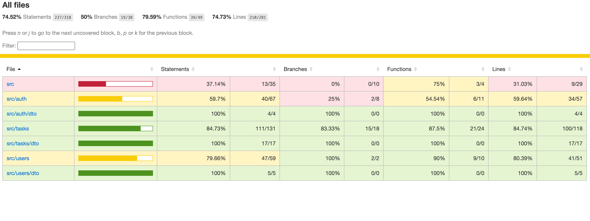

<p align="center">
  <a href="http://nestjs.com/" target="blank"></a>
</p>

[circleci-image]: https://img.shields.io/circleci/build/github/nestjs/nest/master?token=abc123def456
[circleci-url]: https://circleci.com/gh/nestjs/nest

  <p align="center">A progressive <a href="http://nodejs.org" target="_blank">Node.js</a> framework for building efficient and scalable server-side applications.</p>
    <p align="center">
<a href="https://www.npmjs.com/~nestjscore" target="_blank"></a>
<a href="https://www.npmjs.com/~nestjscore" target="_blank"></a>
<a href="https://www.npmjs.com/~nestjscore" target="_blank"></a>
<a href="https://circleci.com/gh/nestjs/nest" target="_blank"></a>
<a href="https://coveralls.io/github/nestjs/nest?branch=master" target="_blank"></a>
<a href="https://discord.gg/G7Qnnhy" target="_blank"></a>
<a href="https://opencollective.com/nest#backer" target="_blank"></a>
<a href="https://opencollective.com/nest#sponsor" target="_blank"></a>
  <a href="https://paypal.me/kamilmysliwiec" target="_blank"></a>
    <a href="https://opencollective.com/nest#sponsor"  target="_blank"></a>
  <a href="https://twitter.com/nestframework" target="_blank"></a>
</p>
  <!--[](https://opencollective.com/nest#backer)
  [](https://opencollective.com/nest#sponsor)-->

## Description

Task Manager Backend built with NestJS, PostgreSQL (via Sequelize), and JWT authentication. It demonstrates a clean modular architecture with clear separation between authentication, users, and tasks domains. The service provides REST endpoints to create, list, edit, and delete tasks, and to assign users to tasks.

## Architecture Overview

- Framework: NestJS (modules, controllers, services)
- Persistence: PostgreSQL using `@nestjs/sequelize` + `sequelize-typescript`
- Auth: JWT (Passport strategy) with register/login endpoints
- Modules:
  - `AuthModule`: registration, login, JWT strategy/guard
  - `UsersModule`: user CRUD (minimal list/get exposed), password hashing using bcrypt
  - `TasksModule`: tasks CRUD, filtering, and assignment/unassignment of users
- Data Models:
  - `User`: id, email, name, passwordHash
  - `Task`: id, title, description, status (OPEN|IN_PROGRESS|DONE), dueDate, createdById
  - `TaskAssignee`: junction table for many-to-many (taskId, userId)

Design decisions and trade-offs:
- Use Sequelize auto-sync (`synchronize: true`) for interview speed; in production use migrations.
- Keep controllers thin; business logic in services; DTOs + global ValidationPipe for validation.
- JWT guard protects all `/users` and `/tasks` endpoints; `/auth` is public.

## Installation

```bash
$ npm install
```

## Configuration

Create a `.env` file or set environment variables (see `.env.example`):

```
DB_HOST=localhost
DB_PORT=5432
DB_USER=postgres
DB_PASSWORD=postgres
DB_NAME=locaboo
JWT_SECRET=super_secret_change_me
JWT_EXPIRES=1d
```

Start a local Postgres (example with Docker):

```bash
docker run --name taskdb -e POSTGRES_PASSWORD=postgres -e POSTGRES_USER=postgres -e POSTGRES_DB=locaboo -p 5432:5432 -d postgres:15
```

## Running the app

```bash
# development
$ npm run start

# watch mode
$ npm run start:dev

# production mode
$ npm run start:prod
```

## Docker & Docker Compose

You can run the API and a PostgreSQL database fully containerized.

Prerequisites: Docker Desktop or compatible Docker + Docker Compose v2.

1) Create your environment file

```
cp .env.example .env
# When using docker-compose the DB host is the service name 'db';
# docker-compose.yml already overrides DB_HOST to 'db'.
```

2) Start with Docker Compose

```
docker compose up --build
```

This will:
- Start Postgres 15 (service `db`) with a persisted volume `db_data`
- Build the app image and start the API (service `api`) on port 3000

3) Access the API

- Swagger UI: http://localhost:3000/docs
- Health check: open the docs URL above or hit any endpoint

4) Stop containers

```
docker compose down
```

To remove the database volume as well:

```
docker compose down -v
```

Notes:
- The app reads database and JWT settings from environment variables. See `.env.example` for defaults. In Compose, `DB_HOST` is set to `db` automatically.
- Sequelize auto-sync is enabled, so tables will be created on first run.

## Logging

The application uses NestJS `Logger` for structured logging and a global request logging interceptor.

- Global request logging: every HTTP request is logged with method, URL, status code, response time, and `uid` (JWT subject if available). Implemented by `RequestLoggingInterceptor` and registered globally in `main.ts`.
- Service-layer logs: critical events and error-worthy conditions are logged in services:
  - `AuthService` logs registration, token issuance, and warns on invalid login attempts.
  - `UsersService` logs user creation and warns when a registration attempts to reuse an existing email or when a user is not found.
  - `TasksService` logs task create/update/delete, assignment/unassignment, and warns on not-found or invalid operations.

How to view logs:
- In development, logs are printed to stdout by Nest. Run `npm run start:dev` and observe the console.

## API Documentation (Swagger/OpenAPI)

- Swagger UI is available at: `http://localhost:3000/docs`
- It documents all available endpoints (auth, users, tasks) and their parameters.
- For protected routes, click the "Authorize" button in the top-right and paste your JWT: `Bearer <token>`.
- The OpenAPI JSON is available at `http://localhost:3000/docs-json`.

## API Endpoints

Auth (public):
- POST `/auth/register` { email, name, password } — returns 201 Created with the created user (no token). Use login next to obtain a JWT.
- POST `/auth/login` { email, password } — returns 201 with `{ user, access_token }`.

Users (JWT required):
- GET `/users` — list users (no passwords returned)
- GET `/users/:id` — get user by id

Tasks (JWT required):
- GET `/tasks?status=OPEN&createdById=...&assigneeId=...` — list tasks with optional filters
- GET `/tasks/:id` — get task by id
- POST `/tasks` { title, description?, status?, dueDate? } — createdBy from JWT
- PATCH `/tasks/:id` { title?, description?, status?, dueDate? }
- DELETE `/tasks/:id`
- POST `/tasks/:id/assign` { userId }
- POST `/tasks/:id/unassign` { userId }

Notes:
- Use `Authorization: Bearer <token>` header for protected routes.
- `dueDate` accepts ISO date string.

## Test

```bash
# unit tests
$ npm run test

# e2e tests
$ npm run test:e2e

# test coverage
$ npm run test:cov
```

Notes about tests:
- Unit tests and e2e tests run against an in-memory SQLite database (via `@nestjs/sequelize`) so you do not need Postgres running to execute tests.
- The production app still uses PostgreSQL as configured in `AppModule`; the test harness wires a separate `SequelizeModule` instance targeting SQLite only for tests (`test/utils/test-app.module.ts`).

## Screenshots

- Test coverage report (example):



## Assumptions
- Single organization scope (no multi-tenant separation).
- Minimal user CRUD is sufficient for demonstrating assignment.
- Idempotent assignment; re-assigning the same user to a task is a no-op.

## Future Improvements
- Replace auto-sync with migrations (sequelize-cli).
- Add pagination and sorting to list endpoints.
- Add ownership/authorization checks (e.g., only creator can edit/delete their tasks).
- Add refresh tokens and password reset flow.
- Add request logging and structured error responses with error codes.
